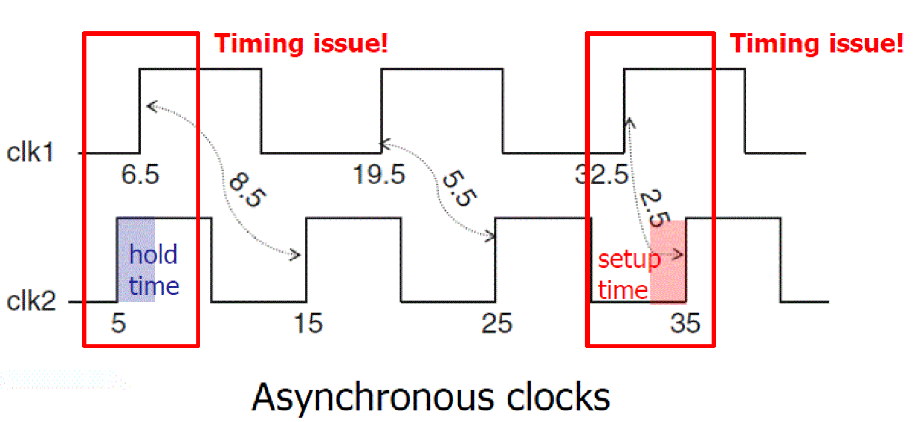

# Digital_Circuit_and_System_Implementation
This page contains codes and projects related to time-domain digital circuit implementation with System-Verilog. From the very beginning logics, like random number comparison, to abstruse design, e.g. Maze Scheme through breadth-fisrt search (BFS) are all involved inside. These codes are certified that executable in normal Linux workstation environments (ModelSim is workable after test). Some special projects will be introduced in the following sections for better understanding. 

## Projects Descriptions

### Vending Machine
There are items able to select inside this vending machine. Customer could choose to pay coins in different values to buy the merchandise they want. It firstly decides whether the paid money is enough to purchase designated item. The vending machine is able to automatically return the money (coins) in a way with the least coins once paid money is sufficient. Therefore, it is a couple if-else and cases inside to determine the coins' number. The error raises since there happens irregular operations.

### Multi-pipeline
Digital system usually is split into mutiple pipeline stages to perform instructions in a most efficient way. I attempted to figure out the optimal solution determining the pipeline stages, therefore consuming less execution time in return. While every tasks in every pipeline stage are not identical, machine should firstly search for the critical path (for which needs the most time) between each pipeline and set it as a standard to split pipelines. This leads to the solution of circuits accordingly.

### Finite-State-Machine (FSM)
Finite-State-Machine is a universal strategy utilizing in the industry since machine is deeply pipelined. Seperating the states into independent cases facilitates performance in stages and eliminate potential overheads. However, this might bring about some negative influence, e.g. complicated logics implementation, when splitting into too many states and further use additional hardware resources. In this project, I performed a simple FSM to simulate a vending machine with the same settings above-mentioned. 

### Clock-Sychronizer
Time issues are commonly appeared in asychronized circuits. The setup time and following overhead cause it incapable of triggering simultaneously. Thus, we would choose to sacrifice a little bit time beforethe execution stage to synchronize the timeline between signals. I conducted Brute-Force sychronizer through two consecutive flip-flops (FFs). Accordingly, the circuit could perform correct logics without the interference from time violation.

### Maze Scheme with BFS
This project applies the breadth-first search algorithm to seek the optimal route in a maze with the least steps. It is 4-directional and traceable. Thus, we have to do a exhaustive search based on BFS until it reaches the goal. The graph below exhibits the situation at the moment it arrives at the destination. This approach needs plenty of conditional branches to determine which direction is convincingly ideal currently. Besides, it is necessary to record the prior steps in case that we have to go back to the cross section if encountering blind alley or turtuous path.

## Contact Info
Author: Chun-Sheng Wu, MS student in Computer Engineering @ Texas A&M University  
Email: jinsonwu@tamu.edu  
LinkedIn: https://www.linkedin.com/in/chunshengwu/
